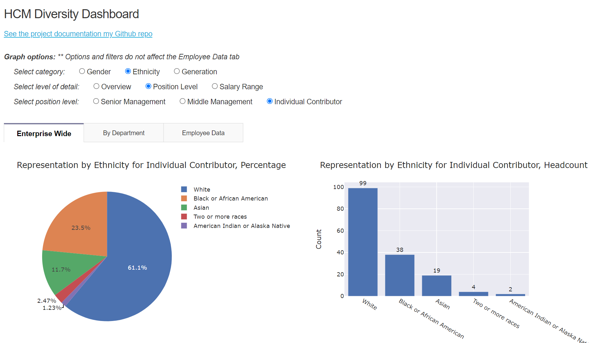

## Overview
This is a dashboard web app coded in Python to explore workforce diversity metrics and is built with the Plotly, Dash, Pandas, and Numpy libraries. The dataset used is a modified version of the fictitious HCM dataset found on [Kaggle](https://www.kaggle.com/rhuebner/human-resources-data-set). 

Please note that this web app is not optimized for mobile devices and is best viewed in widescreen aspect ratios.

## Demo
I have deployed this app on Heroku - [try it out!](https://chc-hcmdash.herokuapp.com/) (***Initial load may take 30 seconds to 1 minute for the VM to spin up*)

